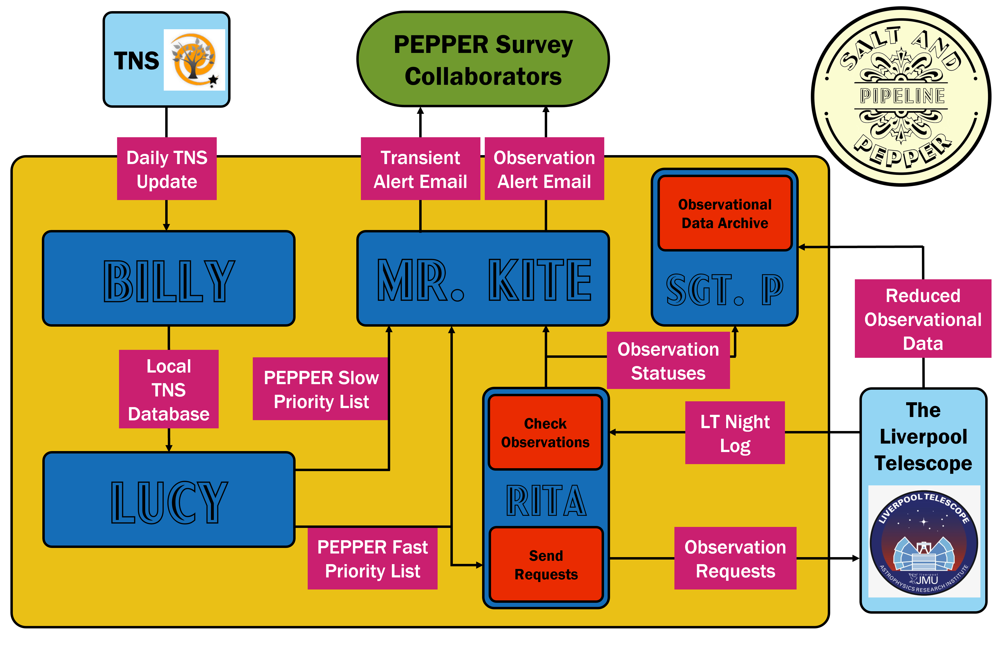

# SALT&PEPPER - Supernova Alerts for the Liverpool Telescope & PEPPER

## An automated pipeline to identify interesting transients from the Transient Name Server (TNS) and request observations of them with the Liverpool Telescope and its MOPTOP instrument for the PEPPER Survey.

### SALT&PEPPER is broken into 5 modules
- BILLY: Updates a local copy of the TNS database using the updates released daily by the TNS at 00:00 UTC.
- LUCY: Calculates the priority score lists for both PEPPER Fast and Slow Surveys.
- MR. KITE: Send out 2 daily email alerts - one with the priority score lists, the other with the statuses of observation requests made to the Liverpool Telescope.
- RITA: Requests observations of the transients with the Liverpool Telescope.
- SGT. P: Automatically downloads any data of observations requested via SALT&PEPPER from the Liverpool Telescope archive.

### Instructions
- Copy the whole file structure to your device.
- Fill out the credential files ("bot_info.json", "email_creds.json", "LT_creds.json", and "LTarchive_creds.json") with the required information.
- Specifiy the observational parameters in the "obs_prams.json" file.
- Add any email addresses to receive alerts in "correspondents.csv" (one per line!)
- Install the required packages using requirements.txt via `pip install -r requirements.txt`.
- Download `ltrtml` from [here](https://github.com/LivTel/ltpy) and put "ltrtml.py" in the base SALT&PEPPER directory.
- `chmod +x SnP`
- Use cron tab to automate SALT&PEPPER to run every night. E.g., `00 22 * * * cd {your path to SALT&PEPPER directory}; bash SnP >> SnP.log 2>&1` will run SALT&PEPPER every day at 22:00 local time and add outputs to a log. Note, a built-in delay means pipeline won't start until after 00:00 UTC when the TNS updates are released.
