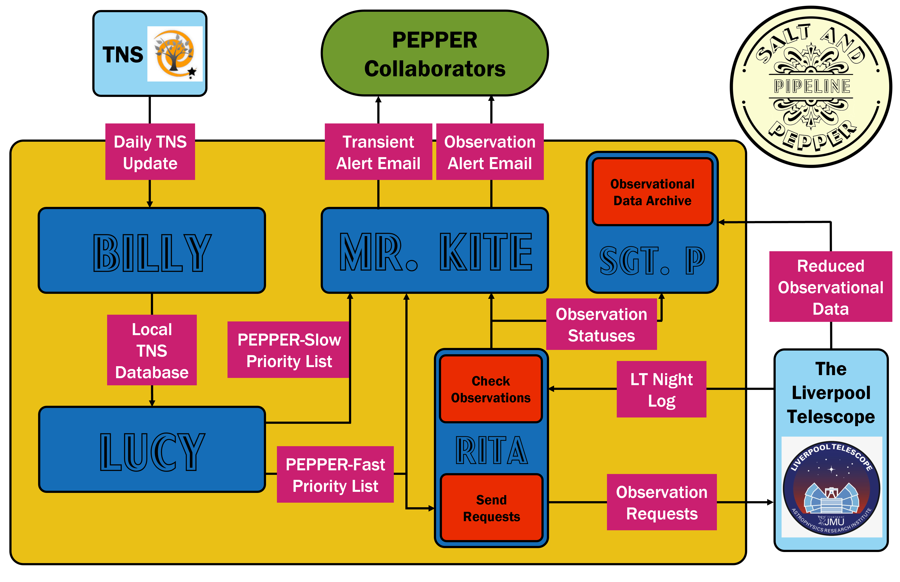

# SALT&PEPPER - Supernova Alerts for the Liverpool Telescope & PEPPER

## An automated pipeline to identify interesting transients from the Transient Name Server (TNS) and request observations of them with the Liverpool Telescope and its MOPTOP instrument for the PEPPER Survey.

### SALT&PEPPER is broken into 4 modules
- BILLY: Updates a local copy of the TNS database using the updates released daily by the TNS.
- LUCY: Calculates the priority score lists for both PEPPER Fast and Slow Surveys.
- MR. KITE: Send out daily email alerts with the priority score lists.
- RITA: Requests observations of the transients with the Liverpool Telescope.

### Instructions
- Copy the whole file structure to your device.
- Fill out the credential files (bot_info.json, email_creds.json, and LT_creds.json) with the required information.
- Add email addresses to correspondents.csv (one per line!)
- Install the required packages using requirements.txt via `pip install -r requirements.txt`.
- Download `ltrtml` from [here](https://github.com/LivTel/ltpy) and put ltrtml.py in the RITA directory.
- `chmod +x SnP`
- Use cron tab to automate SALT&PEPPER to run every night. E.g., `10 01 * * * cd {your path to SALT&PEPPER directory}; bash SnP >> SnP.log 2>&1` will run SALT&PEPPER every day at 01:10 local time.
